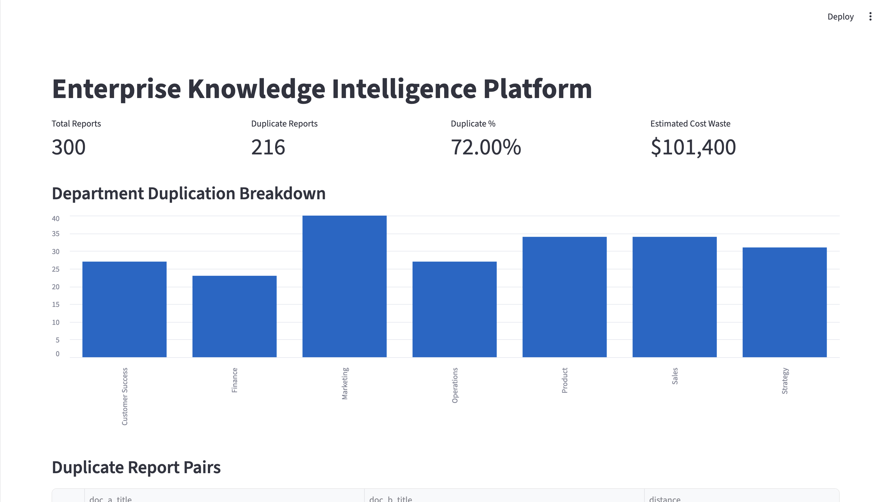
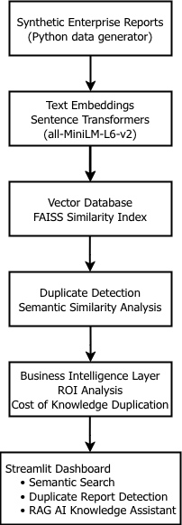
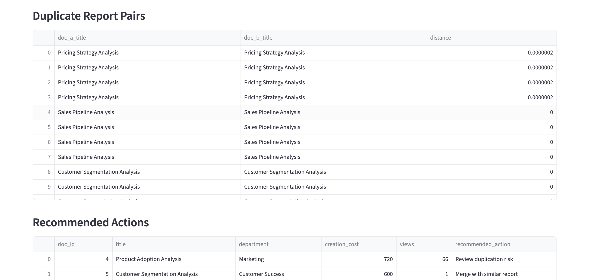
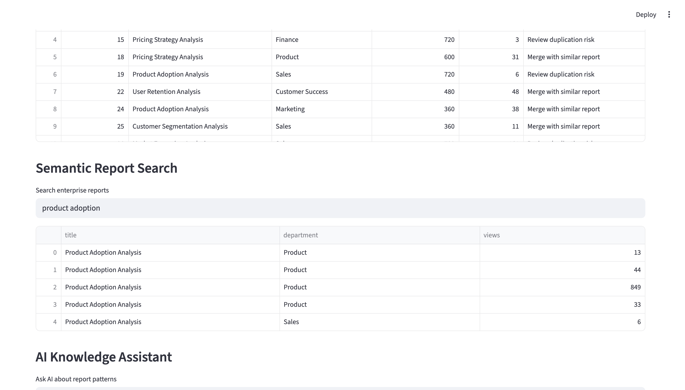
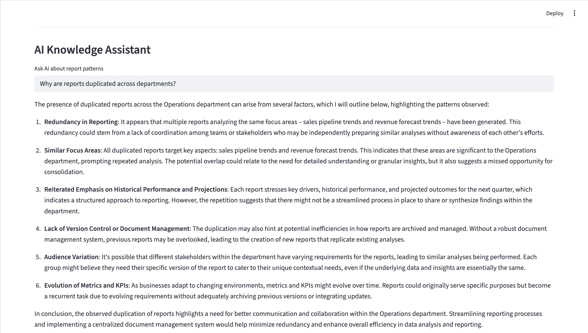

# Enterprise Knowledge Intelligence Platform



**AI-powered system that detects duplicated analytical work, quantifies knowledge waste, and enables semantic discovery of enterprise reports.**

Large organizations generate thousands of internal analytics reports across departments. Because teams often work in silos, analysts frequently recreate similar analyses without realizing that related work already exists.

This project demonstrates how **semantic embeddings, vector search, and retrieval-augmented generation (RAG)** can be used to detect duplicated analytical work and improve enterprise knowledge reuse.

---

# Problem

In many companies:

* Analysts independently create reports on similar topics
* Knowledge becomes fragmented across teams
* Duplicated analysis wastes time and resources

Without a way to **search analytical knowledge semantically**, organizations struggle to reuse existing insights.

---

# Solution

This system simulates an enterprise analytics environment and builds an AI pipeline that:

* Converts reports into **semantic embeddings**
* Detects structurally similar reports using **vector search**
* Estimates **duplicated analytical effort**
* Enables **semantic search across reports**
* Uses an **AI assistant** to explain knowledge patterns

The result is a **Knowledge Intelligence Platform** that surfaces hidden duplication and improves discoverability of analytical work.

---

# System Architecture



### Pipeline Overview

```
Synthetic Enterprise Reports
        ↓
Sentence Transformer Embeddings
        ↓
FAISS Vector Similarity Search
        ↓
Duplicate Report Detection
        ↓
Knowledge ROI Analysis
        ↓
Streamlit Intelligence Dashboard
```

---

# Dashboard

## Executive Overview


Shows:

* Total reports analyzed
* Duplicate report percentage
* Estimated analyst effort wasted
* Department-level duplication trends

---

## Duplicate Report Detection



Identifies reports with highly similar analytical structure.

---

## Semantic Knowledge Search



Users can search enterprise reports using **natural language queries** rather than exact titles.

---

## AI Knowledge Assistant (RAG)



Retrieves relevant reports and generates explanations about analytical patterns and duplication.

---

# Example Insight

In a simulated enterprise dataset of **300 internal analytics reports**, the system detected:

* **216 structurally similar reports**
* **72% duplication rate**
* **$101,400 estimated duplicated analyst effort**

This demonstrates how semantic analysis can surface hidden inefficiencies in analytical workflows.

---

# Technologies Used

* Python
* Sentence Transformers
* FAISS Vector Search
* OpenAI API
* Streamlit
* Pandas / NumPy

---

# Project Structure

```
knowledge-leak-analyzer
│
├── app
│   └── dashboard.py
│
├── scripts
│   ├── generate_data.py
│   ├── embed_documents.py
│   ├── detect_duplicates.py
│   ├── knowledge_search.py
│   └── rag_assistant.py
│
├── data
│   └── processed
│
├── screenshots
│   └── architecture.png
│
└── README.md
```

---
# Pipeline

The analysis pipeline runs in the following stages:

1. Generate synthetic enterprise reports
   scripts/generate_data.py

2. Convert reports into semantic embeddings
   scripts/embed_documents.py

3. Detect semantically similar reports
   scripts/detect_duplicates.py

4. Estimate duplicated analyst effort
   scripts/calculate_roi.py

5. Recommend actions for duplicated work
   scripts/recommend_actions.py

6. Enable semantic search across reports
   scripts/knowledge_search.py

7. Generate AI explanations via RAG
   scripts/rag_assistant.py

8. Visualize insights in Streamlit dashboard
   app/dashboard.py

---

# How to Run

### Clone repository

```
git clone https://github.com/yourusername/knowledge-leak-analyzer.git
cd knowledge-leak-analyzer
```

### Install dependencies

```
pip install -r requirements.txt
```

### Set OpenAI API key

```
export OPENAI_API_KEY="your_api_key"
```

### Generate synthetic reports

```
python scripts/generate_data.py
```

### Create embeddings

```
python scripts/embed_documents.py
```

### Detect duplicates

```
python scripts/detect_duplicates.py
```

### Run semantic search

```
python scripts/knowledge_search.py
```

### Run the RAG assistant

```
python scripts/rag_assistant.py
```

### Launch dashboard

```
streamlit run app/dashboard.py
```

---

# Key Concepts Demonstrated

* Semantic embeddings
* Vector databases
* Similarity search
* Knowledge reuse analytics
* Retrieval-augmented generation (RAG)
* AI-powered BI dashboards
